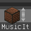
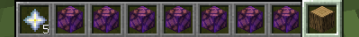

<p align="center">  </p>

<div align="center">

# MusicIt

<!-- prettier-ignore-start -->
<!-- markdownlint-disable-next-line MD036 -->

_Minecraft 红石音乐辅助制作工具_

<!-- prettier-ignore-end -->

</div>


## 功能
- [x] 音域切换
- [x] 自定义音色扩展
- [x] 给定音域特定音频
- [x] 给定音符特定音频
- [ ] 乐器的自定义配置
- [ ] More...

## 快速上手

将数据包安装于存档的datapacks文件夹内，在游戏中进行`reload`指令即可加载数据包。

### 获取 Muit 编辑器

在你的聊天栏中输入以下指令，并将获得的编辑器置于副手即可进入编辑模式。
```mclang
/loot give @s loot muit:muit_editor
```

### 获取基础音符方块

在你的聊天栏中输入以下指令，即可获得对应的 C D E F G A B 音符。
```mclang
/function muit:_get_notes
```

### 切换音色

将方块放在物品栏最后一格（第九格），就可以如同原版一样在音符盒底下放方块从而改变音色。



目前内置以下原版音色。

另外请注意，对于以下音色，如果对应方块过多则不作过多支持，请以以下方块为标准。

| 音色 | 方块 |
|:------:|:------:|
| Harp | 泥土 |
| Bass | 橡木 |
| Hat | 玻璃 |
| Basedrum | 石头 |
| Snare | 沙子 |
| Didgeridoo | 南瓜 |
| Pling | 荧石 |
| Iron Xylophone | 铁块 |
| Bit | 绿宝石 |
| Banjo | 稻草块 |
| Cow Bell | 灵魂沙 |
| Flute | 粘土 |
| Bell | 金块 |
| Chime | 浮冰 |
| Xylophone | 骨块 |
| Guitar | 羊毛 |


### 切换音域

在你进入编辑模式后，你可以获得一个**音域调整器**，按F键即可升调，按Q即可降调。

## 资源包&音色扩展

详看[WIKI](https://github.com/Huanlan233/MusicIt/wiki)。（暂未完工）